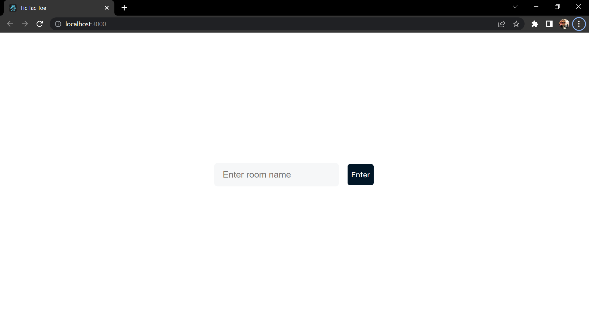
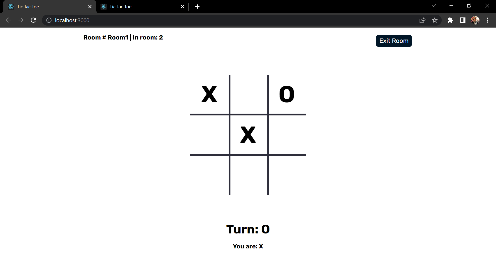
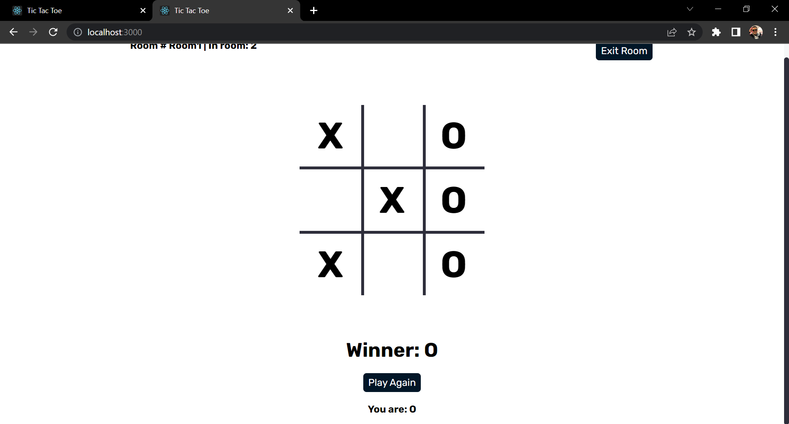

#SIMPLE TICTACTOE GAME I made so i could learn how to use socket.io  
this game need two players where each one of them use a room name to login and play agaosnt each other:  
 # Here are some Screenshots of the App :  
 - Login to the Room you and your opponent :  
  
 - Enjoy the game :  
  
  
